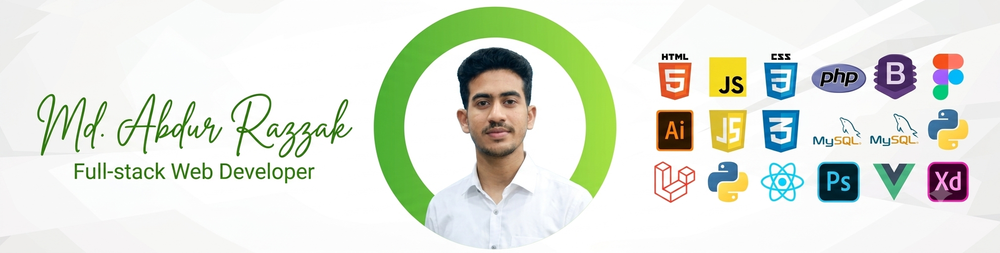

  

<h1 align="center">Hi 👋, I'm Md. Abdur Razzak</h1>

<h3 align="center">
Laravel & PHP Web Developer | OOP Enthusiast | Building Scalable Web Applications | Exploring React, Next.js & Modern Web Technologies
</h3>

  

---

### 👨‍💻 About Me

* 🔭 Currently working on **Laravel & PHP Web Development Projects**
* 🌱 Currently learning **React, Next.js & TypeScript**
* 💡 Interested in **PHP OOP, Clean Code & Software Architecture**
* 🚀 Exploring how to build **my own PHP framework**
* 🛠️ Building practical web applications with **Laravel, PHP & MySQL**
* 👨‍💻 All of my projects are available on [GitHub](https://github.com/abrazzakcmt-lang)
* 💬 Ask me about **Laravel, PHP, WordPress, PHP OOP, MySQL, Blade, Tailwind CSS & Web Development**
* 📫 Reach me at **[ab.razzakcmt@gmail.com](mailto:ab.razzakcmt@gmail.com)**
* 📄 [View My Resume](https://drive.google.com/file/d/1TsiP8WKRKnqMwyChbTMMkzBJniqOpBg_/view?usp=sharing)

---

### 🌐 Connect with Me

  

---

### 🛠️ Languages & Tools

  

  

  

  

  

  

  

  

  

  

  

  

  

  

---

### 📊 GitHub Statistics

  

  

